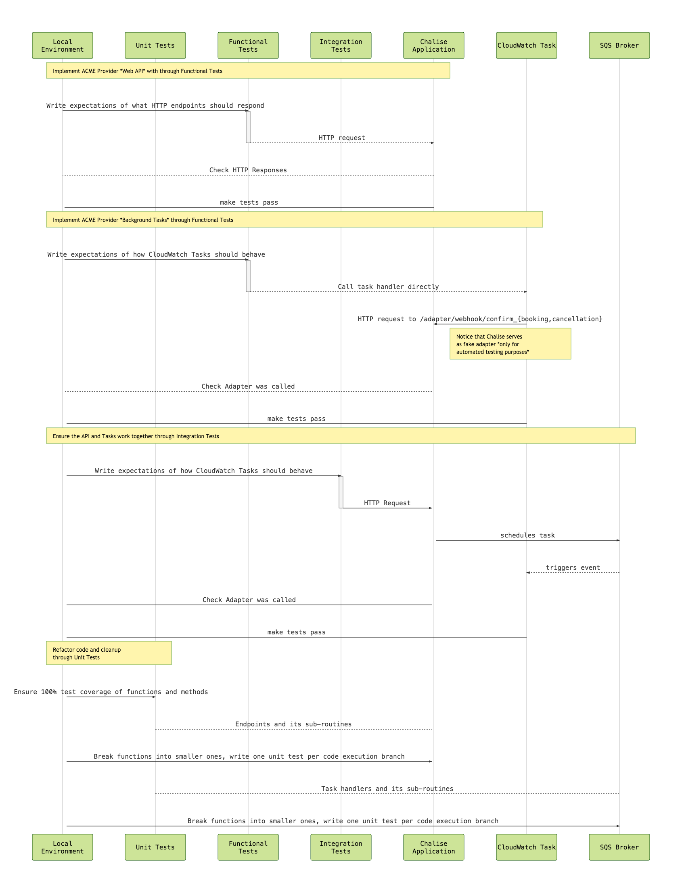
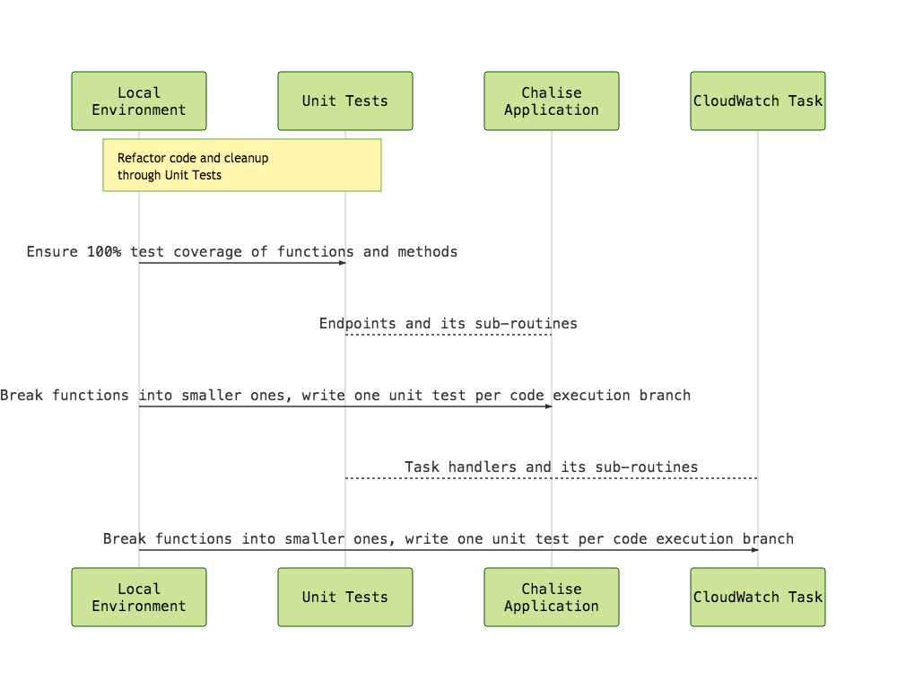
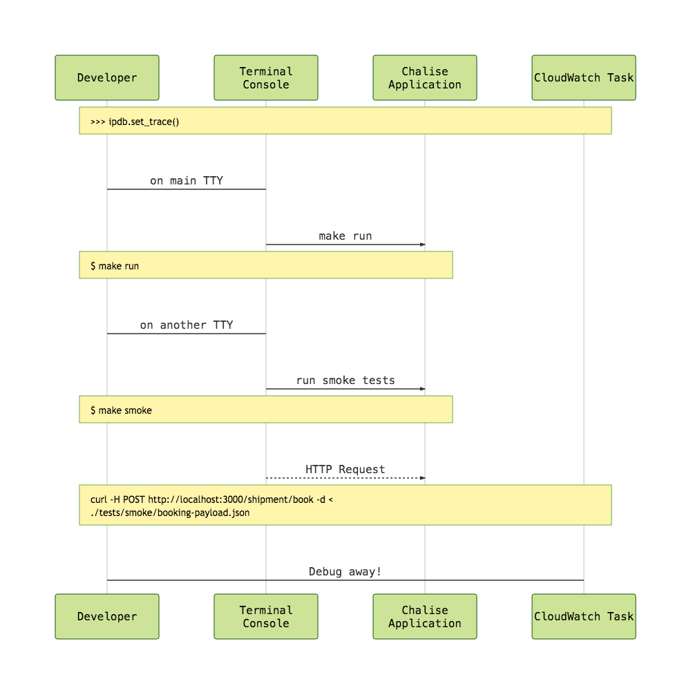

MacumbaPass
===========

An experimental lambda-based password manager API made with `chalice <chalice.readthedocs.io>`_, `localstack <https://localstack.cloud>`_ and `SAM Local <https://github.com/awslabs/aws-sam-local>`_.

Goals:

- Ability to develop the whole AWS application entirely in the local environment, no need for real AWS until is time to deploy.
- Leverage a development workflow similar to test-driven `Flask <http://flask.pocoo.org>`_ applications

Running Locally
---------------

.. code:: bash

Development Workflow
--------------------

Test-Driven Development
-----------------------

Local Debugging
---------------

